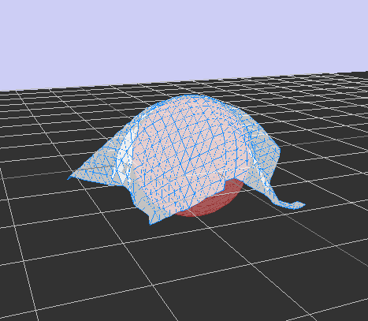
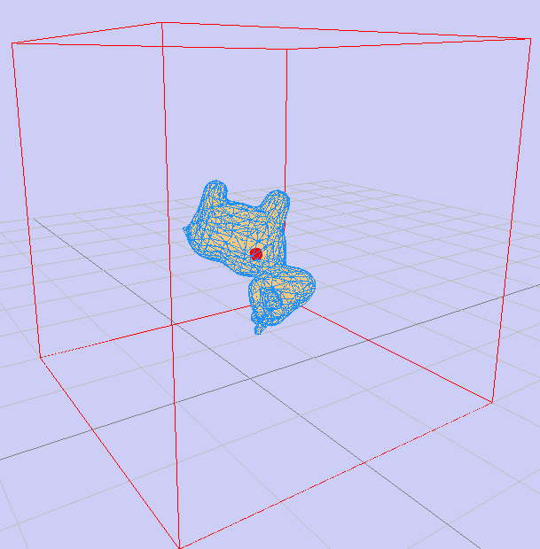

# XPBD Examples

This directory contains example applications demonstrating various capabilities of the XPBD physics engine. Each example showcases different aspects of deformable body simulation using Extended Position Based Dynamics.

## Examples Overview

| Example | Description | Screenshot |
|---------|-------------|------------|
| [Plane Surface Deformation](#plane-surface-deformation) | Interactive cloth physics with center force application | - |
| [Cloth Draping](#cloth-draping) | Realistic cloth falling and draping over a sphere |  |
| [Inflation Demo](#inflation-demo) | Soft body inflation using volume constraints | - |
| [Spot in Box](#spot-in-box) | Physics simulation with box constraints and periodic forces |  |

## Plane Surface Deformation

Demonstrates cloth physics using a triangulated surface mesh on a subdivided square. The cloth is fixed at boundaries and after some time a force is applied to its center, creating realistic deformation patterns.

### Usage

```bash
cargo run --example deform_demo
cargo run --example deform_demo -- --resolution 30 --size 6.0
```

### Controls

- **X**: Toggle Wireframe 
- **F**: Toggle Faces 
- **R**: Reset simulation
- **Space/Shift**: Move camera up/down 
- **Mouse**: Rotate camera

### Implementation Details

- Creates a subdivided square mesh with triangular faces
- Boundary vertices are constrained with high inverse mass (effectively fixed)
- Interior vertices maintain structural integrity through edge constraints
- Weak bending constraints prevent excessive folding
- After 3 seconds: strong downward force applied at cloth center for 1 second

### Parameters

- `--resolution`: Grid resolution (default: 20)
- `--size`: Cloth size in world units (default: 5.0)

## Cloth Draping

Demonstrates realistic cloth draping simulation where a cloth mesh falls under gravity and naturally drapes over a spherical obstacle. This example showcases collision detection and realistic cloth behavior.


### Usage

```bash
cargo run --example cloth_draping
cargo run --example cloth_draping -- --resolution 25 --size 4.0 --height 2.5 --sphere-radius 1.0
```

### Controls

- **X**: Toggle Wireframe 
- **F**: Toggle Faces 
- **R**: Reset simulation
- **Space/Shift**: Move camera up/down 
- **Mouse**: Rotate camera

### Implementation Details

- Uniform mass distribution across all cloth vertices
- Cloth spawned at specified height above sphere
- Gravity-driven dynamics with realistic damping
- Sphere collision detection prevents mesh penetration
- Constraint-based physics maintains cloth structure during draping

### Parameters

- `--resolution`: Cloth grid resolution (default: 25)
- `--size`: Cloth size in world units (default: 4.0)
- `--height`: Spawn height above sphere (default: 2.5)
- `--sphere-radius`: Radius of the draping sphere (default: 1.0)

## Inflation Demo

Demonstrates soft body inflation mechanics using volume constraints to scale tetrahedral mesh volumes. The example uses the `deci_spot` mesh which inflates over time, showcasing internal pressure simulation.

### Usage

```bash
cargo run --example inflation_demo
cargo run --example inflation_demo -- path/to/custom/mesh
```

### Controls

- **X**: Toggle Wireframe 
- **F**: Toggle Faces 
- **P**: Pause/Resume simulation
- **R**: Reset simulation
- **Space/Shift**: Move camera up/down 
- **Mouse**: Rotate camera

### Implementation Details

- 2-second free fall phase under gravity
- 5-second inflation phase scaling `p_volume` from 1.0x to 2.5x
- Internal pressure created through volume constraint scaling
- Edge constraints maintain structural mesh integrity
- Supports tetrahedral meshes (TetGen `.node/.ele/.edge/.face` or `.bin` format)

### Mesh Requirements

Uses tetrahedral meshes with volume constraints. The default mesh is `deci_spot.bin`, a decimated version of "Spot the Cow" by Keenan Crane.

## Spot in Box

Demonstrates constrained physics simulation with periodic force application. A tetrahedral mesh is confined within a box using collision callbacks and experiences periodic impulse forces, creating dynamic bouncing behavior.


### Usage

```bash
cargo run --example spot_in_box
```

### Controls

- **R**: Reset simulation
- **Mouse**: Rotate camera

### Implementation Details

- Mesh spawns at fixed height within box constraints
- Box collision detection using callback-based constraint system
- Periodic force application every 1.5 seconds for 0.1-second duration
- Force magnitude follows inverse square law: F = k/r²
- Force vector cycles through 4 preset directions
- Distance threshold and maximum force capping ensure simulation stability

### Physics Parameters

- Force application frequency: 1.5 seconds
- Force duration: 0.1 seconds  
- Force law: Inverse square distance from mesh centroid
- 4 cyclic force directions for varied motion patterns

## Building and Running

All examples can be built and run using Cargo:

```bash
# Build all examples
cargo build --examples

# Run specific example
cargo run --example <example_name>

# Run with custom parameters
cargo run --example <example_name> -- [parameters]
```

## Technical Notes

- All examples use the raylib graphics backend for real-time visualization
- Physics timestep and substep parameters are tuned per example for stability
- Mesh loading supports both TetGen ASCII format and binary serialization
- Interactive controls provide real-time simulation manipulation
